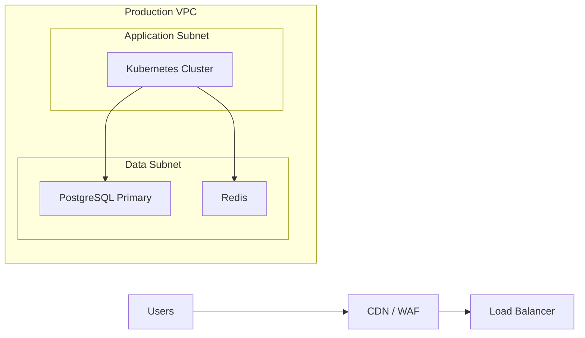
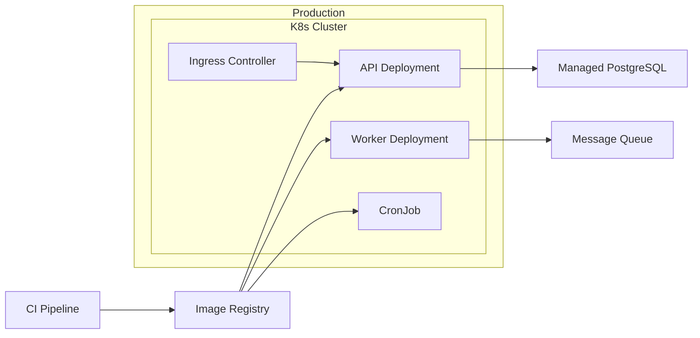

# Diagram Rules

Use this reference when the architecture is large, the input is messy, or the first draft risks becoming unreadable.

## Scope Selection

Pick one abstraction level per diagram.

- System level: best for explaining full topology across major platforms
- Platform level: best for clusters, gateways, data stores, and shared infrastructure
- Service level: best for individual workloads and their deployment units

Avoid mixing all three in one diagram unless the user explicitly wants a dense view.

## Physical Diagram Heuristics

- Prefer zones like `Internet`, `DMZ`, `VPC`, `Subnet A`, `K8s Cluster`, `Data Tier`
- Show important trust boundaries and cross-zone links
- Group identical servers into a summarized node when counts matter more than identity
- If HA matters, label it tersely, such as `"App Nodes x3"`

## Deployment Diagram Heuristics

- Prefer environments first, then cluster or namespace, then workload
- Show rollout chain only if it helps the reader
- Distinguish deployable units from infrastructure boxes
- Put config, secrets, and registry near the workloads that consume them

## Mermaid Patterns

### Physical

### Deployment

## Final Check

- If a node label feels sentence-like, shorten it
- If more than 12-15 nodes appear in a single flat row, add grouping
- If arrows cross heavily, rotate or regroup before finalizing
- If the physical and deployment diagrams are nearly identical, one of them is under-specified

## Image Export Checklist

When exporting to an image file instead of returning Mermaid only:

- Use PNG by default
- Save to `/Users/edy/Downloads/AI/images`
- Ensure the directory exists before writing
- Choose a semantic English filename such as `physical-deployment-architecture-20260420-153000.png`
- Return the absolute path to the saved file
- Keep all text inside boxes with wrapping enabled
- Resize text, cards, gutters, or canvas when readability is weak
- Do not place source-reference text in the image
