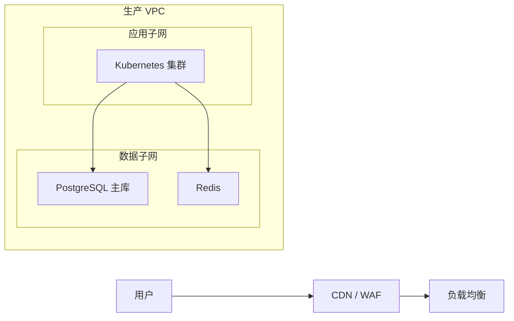

# 架构图补充规则

当系统规模较大、输入材料混乱，或者第一版草图已经开始影响可读性时，再读取本文件。

## 作用域选择

每张图只选一个主要抽象层级。

- 系统级：适合解释跨平台、跨网络的大范围整体拓扑
- 平台级：适合展示集群、网关、数据存储和共享基础设施
- 服务级：适合展示具体工作负载及其部署单元

除非用户明确要求高密度视图，否则不要把三个层级揉进一张图里。

## 物理架构图启发式规则

- 优先按 `Internet`、`DMZ`、`VPC`、`子网 A`、`K8s 集群`、`数据层` 这类区域组织
- 表达重要信任边界和跨区链路
- 当多台服务器只是数量不同、角色相同时，可合并成汇总节点
- 如果高可用很重要，可以用简短方式表达，例如 `"应用节点 x3"`

## 部署架构图启发式规则

- 优先先画环境，再画集群或命名空间，最后画工作负载
- 只有在确实帮助理解时才画完整发布链路
- 明确区分“基础设施盒子”和“可部署单元”
- 配置、密钥和镜像仓库应尽量放在它们所服务的工作负载附近

## Mermaid 模式

### 物理架构图

### 部署架构图

## 最终检查

- 如果某个节点标签像一句完整句子，优先缩短
- 如果一排平铺节点已经超过 12 到 15 个，应考虑分组
- 如果连线交叉明显，先调整方向或重新分组
- 如果物理图和部署图几乎一样，说明至少有一张图的视角还不够明确

## 图片导出检查清单

当需要导出图片文件，而不是只返回 Mermaid 时：

- 默认使用 PNG
- 保存到 `/Users/edy/Downloads/AI/images`
- 写文件前确保目录存在
- 选择有语义的英文文件名，例如 `physical-deployment-architecture-20260420-153000.png`
- 在回复中返回图片绝对路径
- 保证所有文字都在框内，并开启自动换行
- 如果可读性不足，优先调整字号、卡片高度、间距或画布尺寸
- 图片中不要放来源说明文字
